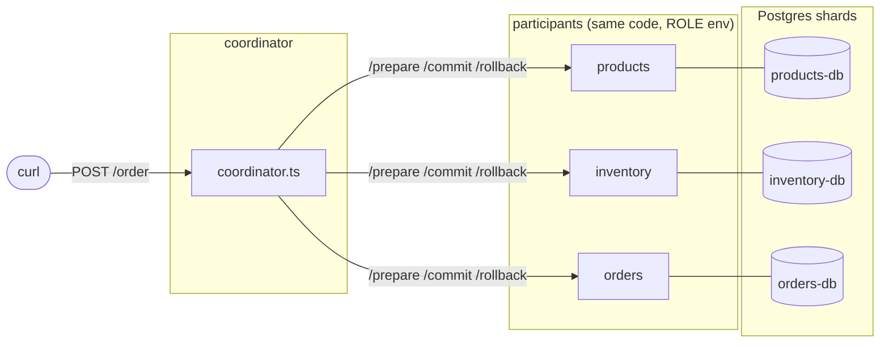
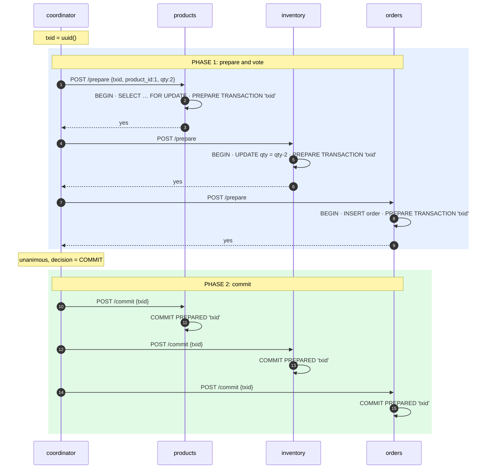
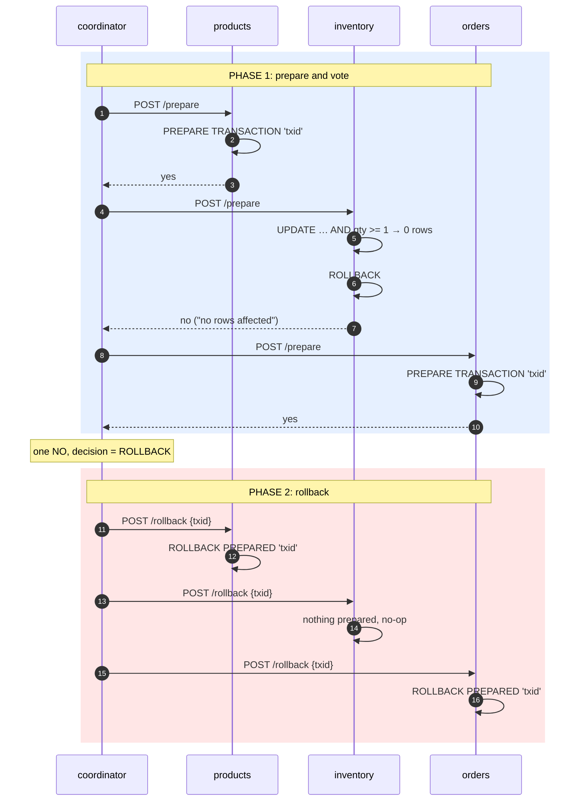
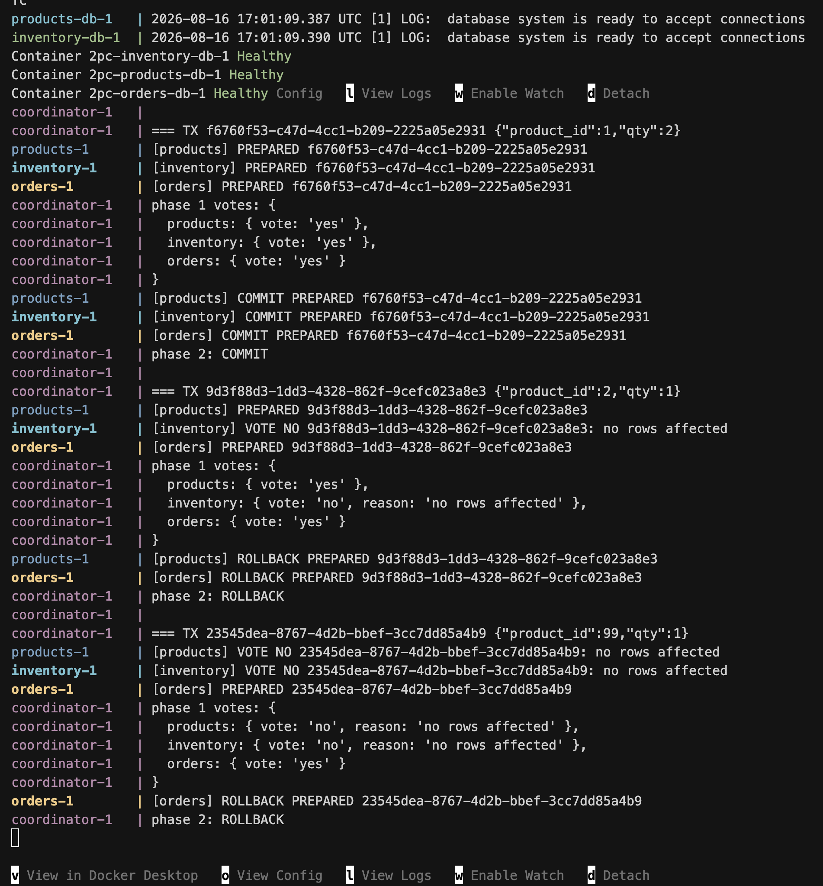

# Two-Phase Commit

One order touches three databases. Either all three change, or none do.
This demo keeps that promise with native Postgres 2PC:
`PREPARE TRANSACTION` / `COMMIT PREPARED` / `ROLLBACK PREPARED`.

```sh
docker compose up --build
```

---

## Setup



| Piece | File | Job |
|---|---|---|
| Coordinator | `coordinator.ts` | Receives the order, runs both phases, decides commit or rollback |
| Participants | `participant.ts` | One process per shard. Does its work in a transaction, then votes |
| Shards | `init/*.sql` | One table and seed data each |

Each shard does one thing per order:

| Shard | SQL inside the transaction | Votes NO when |
|---|---|---|
| products | `SELECT id FROM products WHERE id = $1 FOR UPDATE` | product missing |
| inventory | `UPDATE inventory SET qty = qty - $2 WHERE product_id = $1 AND qty >= $2` | not enough stock |
| orders | `INSERT INTO orders (id, product_id, qty) VALUES (...)` | never |

---

## The idea

Phase 1: the coordinator asks every participant to prepare. Each does its work and votes.
Phase 2: unanimous YES means `COMMIT PREPARED` everywhere, any NO means `ROLLBACK PREPARED` everywhere.

A YES vote is binding. `PREPARE TRANSACTION` writes the transaction to disk before the
participant answers, so it can still commit after a crash. Whatever the coordinator
decides, the participant can do it.

---

## Happy path

```sh
curl -X POST localhost:8000/order -H 'content-type: application/json' -d '{"product_id":1,"qty":2}'
```



Logs:

```
coordinator-1 | === TX 8d05…  {"product_id":1,"qty":2}
products-1    | [products]  PREPARED 8d05…
inventory-1   | [inventory] PREPARED 8d05…
orders-1      | [orders]    PREPARED 8d05…
coordinator-1 | phase 1 votes: { products: yes, inventory: yes, orders: yes }
products-1    | [products]  COMMIT PREPARED 8d05…
inventory-1   | [inventory] COMMIT PREPARED 8d05…
orders-1      | [orders]    COMMIT PREPARED 8d05…
coordinator-1 | phase 2: COMMIT
```

Inventory `5 → 3`, one row in `orders`.

---

## Abort path

Product 2 has zero stock.

```sh
curl -X POST localhost:8000/order -H 'content-type: application/json' -d '{"product_id":2,"qty":1}'
```



`products` and `orders` had already prepared and were ready to commit. They throw
that work away. Nothing changed anywhere.

Third case, a product that does not exist:

```sh
curl -X POST localhost:8000/order -H 'content-type: application/json' -d '{"product_id":99,"qty":1}'
```

All three runs, as seen in `docker compose up`:



---

## Look at the in-between state

Between the phases the transaction is prepared but not committed. Postgres lists these
in `pg_prepared_xacts`. Pause the coordinator for 10 s between phases and query it:

```yaml
# docker-compose.yml, coordinator
environment: { PAUSE_BEFORE_PHASE2_MS: 10000 }
```

```sh
docker compose up --build -d
curl -X POST localhost:8000/order -H 'content-type: application/json' -d '{"product_id":1,"qty":1}' &
sleep 2
docker compose exec inventory-db psql -U postgres -c 'select gid, prepared from pg_prepared_xacts'
```

```
                 gid                  |           prepared
--------------------------------------+-------------------------------
 c314…-9262-ab717c8e70c1              | 2026-08-16 16:21:03.10141+00
```

While that row exists, product 1 is locked in `inventory`. Ten seconds later it commits and the row is gone.

---

## The weakness: 2PC blocks

Same thing, but kill the coordinator during the pause:

```sh
curl -X POST localhost:8000/order -H 'content-type: application/json' -d '{"product_id":1,"qty":1}' &
sleep 2
docker compose kill coordinator
```

Every shard has prepared. The coordinator dies before sending a decision.

```sh
docker compose exec inventory-db psql -U postgres -c 'select gid from pg_prepared_xacts'
# still there

docker compose exec inventory-db psql -U postgres -c 'update inventory set qty = 100 where product_id = 1'
# hangs: the prepared transaction holds the row lock
```

Participants cannot decide alone; the coordinator may already have told someone else
to commit. They are stuck until the coordinator returns or a human intervenes. This is
why real systems add a coordinator recovery log and timeouts, and why many reach for
sagas instead.

Clean up by hand:

```sh
docker compose exec inventory-db psql -U postgres -c "rollback prepared '<gid from above>'"
```

---

## Cheat sheet

| Phase | Coordinator says | Participant does | Postgres statement |
|---|---|---|---|
| 1 | prepare | do the work, vote | `BEGIN … PREPARE TRANSACTION 'gid'` |
| 2, all yes | commit | make it permanent | `COMMIT PREPARED 'gid'` |
| 2, any no | rollback | discard | `ROLLBACK PREPARED 'gid'` |

Guarantee: atomic across shards.
Cost: two round trips, locks held across the network, blocks if the coordinator dies.

---

## Files

```
docker-compose.yml   3 postgres shards + 3 participants + coordinator
Dockerfile           node:22-slim, runs .ts via tsx
coordinator.ts       POST /order, phase 1, phase 2
participant.ts       ROLE=products|inventory|orders, /prepare /commit /rollback
init/*.sql           one table + seed data per shard
```

Reset (drops volumes, reseeds):

```sh
docker compose down -v && docker compose up --build
```
